# Rally 

## Introduction
Rally is a geolocation based social event planning app for iOS. Rally was built around the concept to make social event planning easier. Users can create events complete with a title, start time, and description, they then have the option to select specific groups of friends to invite or to make the event public. Rally events are displayed in a map view with markers designating events happening around you.

## Features
  - Facebook authentication
  - Create and invite your own groups of friends to events
  - Add people to a group by email
  - Real time group chat
  - Real time event creation complete with event details, start time, and description
  - Real time event custom marker rendering on map page
  - Real time feed updates and invitation notifications for groups and events
  - Suprise button offers randomized event look up to help users make spontaneous plans

####Loading Page
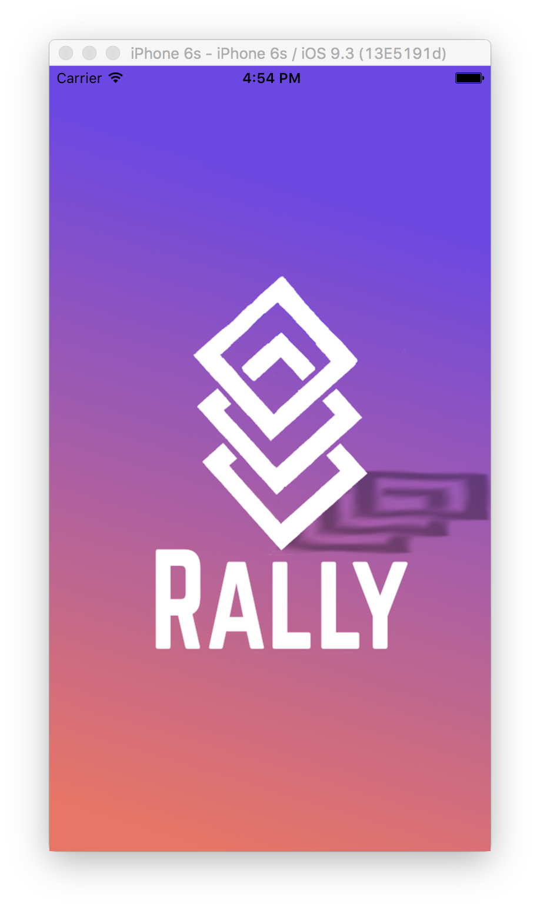

####Login/Sign Up Page

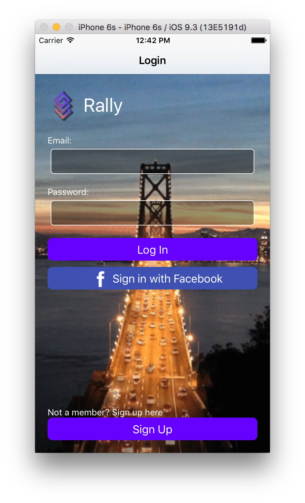
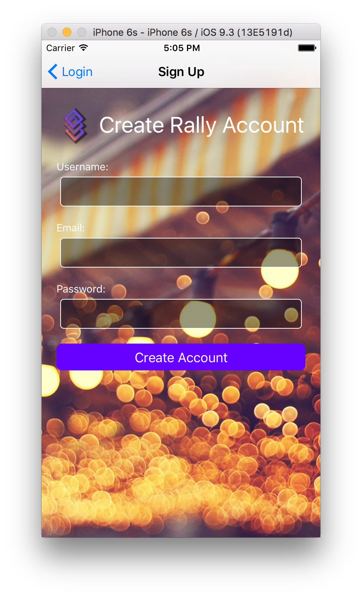

####Map Page with Custom Rally Markers
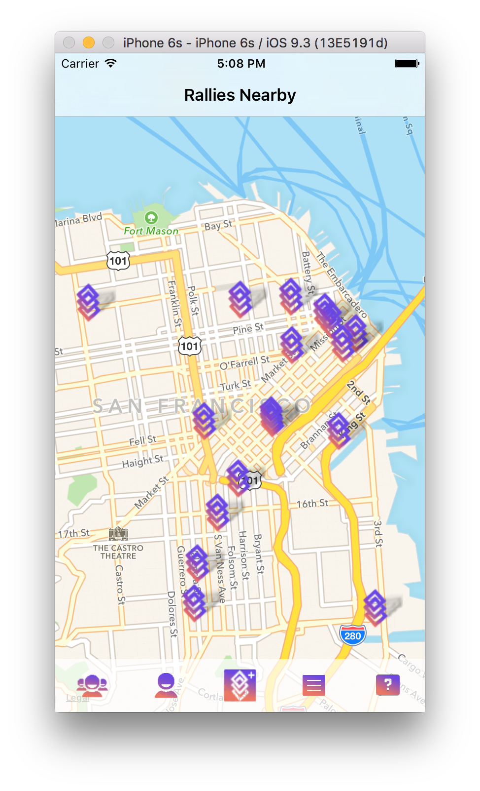
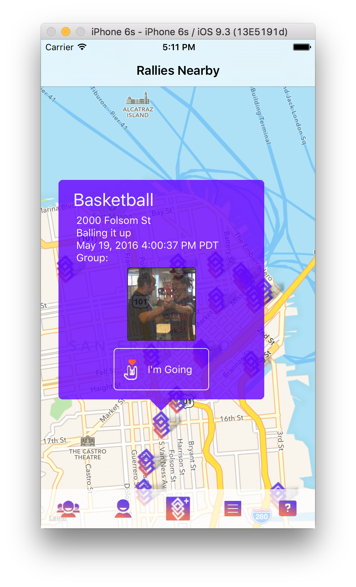

####Groups Page & Group Creation
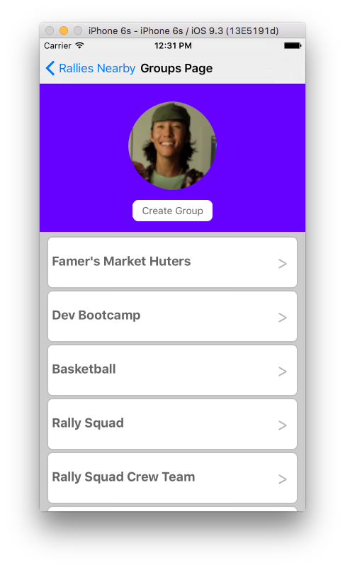
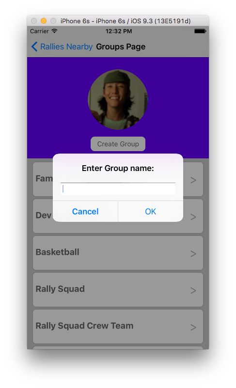

####Group Chat & Add User Functionality
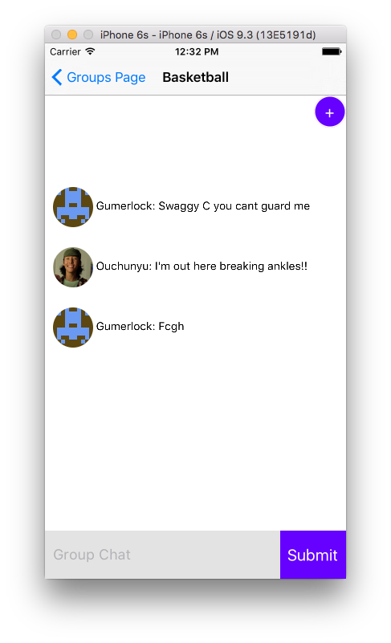
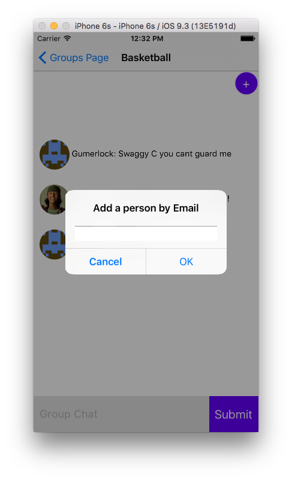

####Event Creation & Groups Invite Page
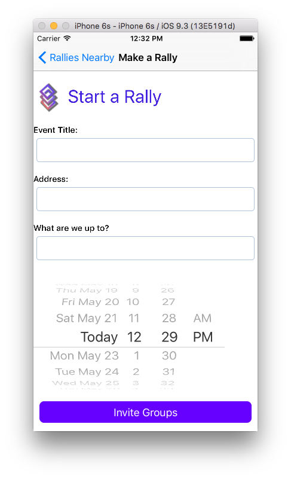
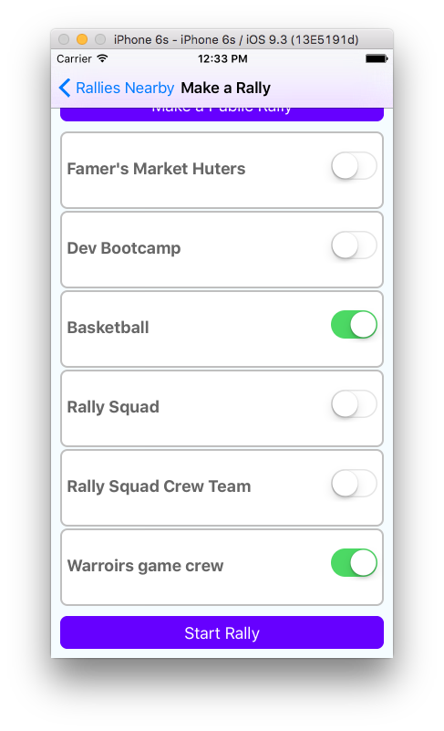

####Real Time Notifications and Updates & User Profile
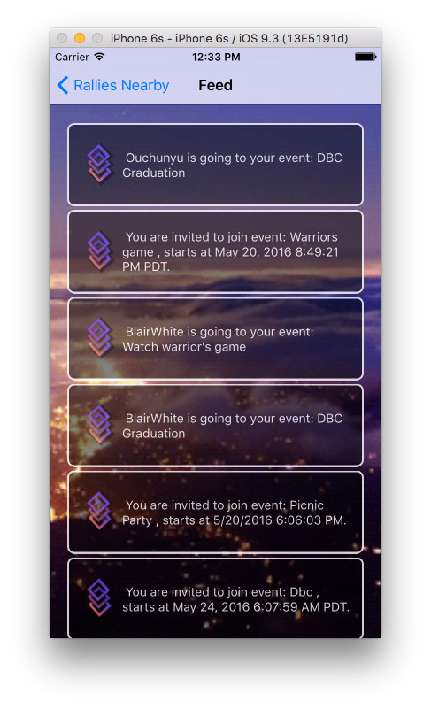
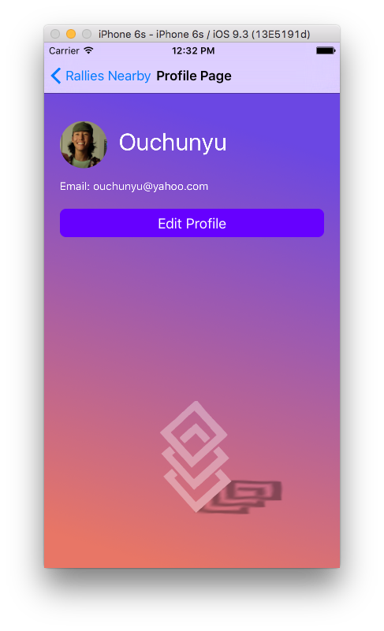

####Randomized Event Look Up
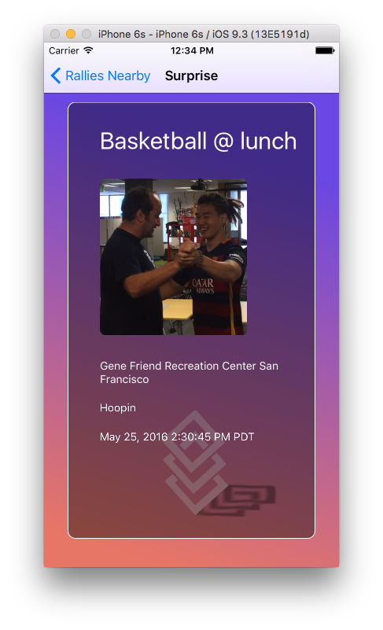


##Tech Stack Used
React Native

Firebase

##Test it on your Local Machine
- Clone this repo ```git clone https://github.com/kevniu/Rally.git```
- ```cd Ralli```
- run `npm install` in your command line tool
- Open Ralli.xcodeproj in XCode
- Press cmd+r to complete build
- Create an account on the signup page to get started using the app.


## Collaborators
- Blair White
- Chunyu Ou
- Eric Gumerlock
- Kevin Niu
- Miqueas Hernandez


## Note to all Collaborators
** All warning messages are disabled, to activate go change** <br />
```javascript
jsCodeLocation = [NSURL URLWithString:@"http://localhost:8081/index.ios.bundle?platform=ios&dev=true"];
```
<br />
**to**
<br />
```javascript
jsCodeLocation = [NSURL URLWithString:@"http://localhost:8081/index.ios.bundle?platform=ios&dev=false"];
```
